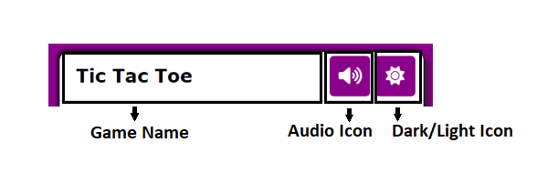
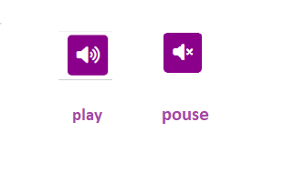
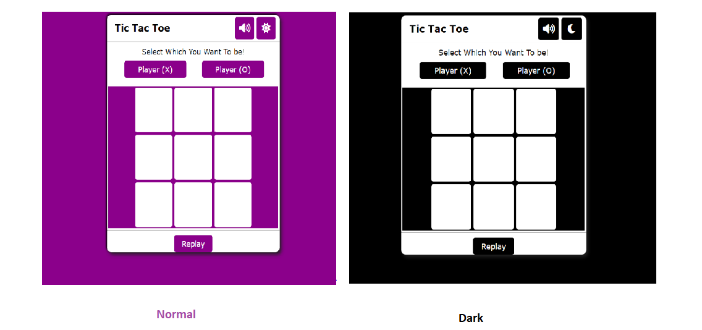
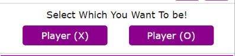
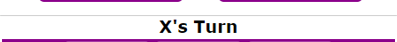
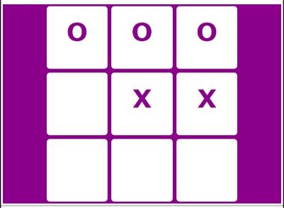
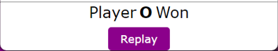
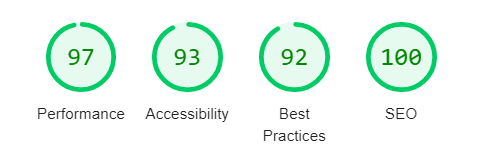

# Tic Tac Toe

Tic Tac Toe  is a site that hopes to demonstrate how pure JavaScript works in a real-world context. The site will be targeted toward people who not only love to implement more advanced JavaScript concepts but also play games.

 Tic Tac Toe is a fully responsive javascript game that allows users to play exciting game, also this site has an interesting sound to enjoy the game and it is controllable, because you can click on the sound icon and  Play and pause the sound.

 The background of Tic Tac Toe game is very flexible because if you want to change the background mode to dark, you can do it easily by clicking on the dark icon.

 

### Existing Features

- __The Tic Tac Toe Heading__

  - Game Name: Featured at the top of the page, the Tic Tac Toe and heading is easy to see for the user. Upon viewing the page, the user will be able to see the name of the game.

  
  
  - Voice Icon:There is an icon for audio, and we can play and pause the audio with that and when we click on that the icon will chang by the play or pause

  

  - Dark/Light icon: This makes the website more flexible as it helps the user to change the background mode to dark or change it to normal, also the normal icon is sun and dark mode changes to moon.

   

- __Choice player section__

   - In this section user will choice which one he/she want to be? There is two sign: X and Y.also X is the default player sign.

   

- __Player turn section__

   - This section show the players turn during the game.It can be so usefull for user to know,the how is turn?

   
   
- __The Game Area__

  - This section will allow the user to play the Tic Tac Toe game. The user will be able to easily see icons for each player.

  - The user will be able to select the  cells of Tic Tac Toe game they will be playing by clicking on the different cells. 
   
   

- __The Tic Tac Toe Footer__

  - In this section we have two parts:Result part and replay part.
   - Result part :in this section will show  the won player.
   - Replay section: allow the user to play game agian. also during the game user can replay game.

  

  

### Testing
- I tested that this page works in different browsers: Chrome, Firfox, Safari.
 
- I confirmed that this project is responsive, looks good and functions on all standard screen sizes using the devtools device toolbar.
 
- I confirmed that the  all of game section are readable and easy to play.

## Validator Testing 

- HTML
  - No errors were returned when passing through the official W3C validator.
- CSS
  - No errors were found when passing through the official W3C validator.
- Accessibility
     - I confirmed that the colors and fonts chosen are easy to read and accessible by running it through lighthouse in devtools.

     

      

## Technologies Used 

I have used several technologies that have enabled this design to work:

- [HTML](https://developer.mozilla.org/en-US/docs/Web/HTML)
    - Used as the basic building block for the project and to structure the content.
- [CSS](https://developer.mozilla.org/en-US/docs/Learn/Getting_started_with_the_web/CSS_basics)
    - Used to style all the web content across the project. 
- [JavaScript](https://www.javascript.com/)
    - Used for the responsive navbar, scroll down arrow and image gallery.
- [Google Developer Tools](https://developers.google.com/web/tools/chrome-devtools)
    - Used as a primary method of fixing spacing issues, finding bugs, and testing responsiveness across the project.
- [GitHub](https://github.com/)
    - Used to store code for the project after being pushed.
- [Gitpod](https://www.gitpod.io/)
    - Used as the development environment.
- [Grammarly](https://www.grammarly.com/)
    - Used to fix the thousands of grammar errors across the project.
- [Coloors](https://coolors.co/)
    - Used to create a colour palette for the design.
- [W3C Markup Validation Service](https://validator.w3.org/) 
    - Used to validate all HTML code written and used in this webpage.
- [W3C CSS Validation Service](https://jigsaw.w3.org/css-validator/#validate_by_input)
    - Used to validate all CSS code written and used in this webpage.
- [AmIResponsive](http://ami.responsivedesign.is/)
    - Used to generate repsonsive image used in README file.

## Deployment

I deployed this website by using GitPages and following the below steps:

*GitHub pages deployment* 

1. Log in to GitHub
2. In your Repository section, select the project repository that you want to deploy
3. In the menu located at the top of this section, click 'Settings'
4. Select 'Pages' on the left-hand menu - this is around halfway down
5. In the source section, select branch 'Master' and save
6. The page is then given a site URL which The live link can be found here:      
     -https://zahramousavi612.github.io/Tic-Tac-Toe-Game/

## Credits  

### Content 

- The game main function that used in game area,I saw that from youtube  video. 

### Media

- The audio used on the game is from an application that I downloaded and then I change the format of that to .mp3 to be accessible to all browser

