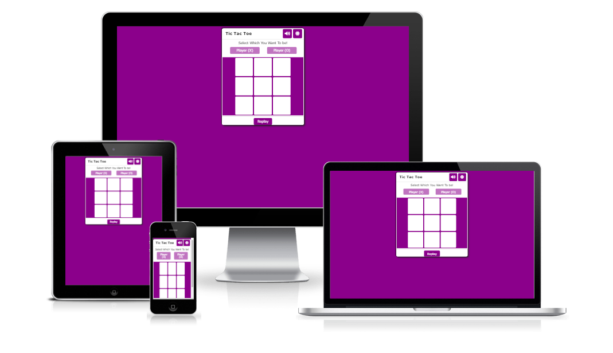

# Tic Tac Toe

Tic Tac Toe  is a site that hopes to demonstrate how pure JavaScript works in a real-world context. The site will be targeted toward people who not only love to implement more advanced JavaScript concepts but also play games.

 Tic Tac Toe is a fully responsive javascript game that allows users to play exciting game, also this site has an interesting sound to enjoy the game and it is controllable, because you can click on the sound icon and  Play and pause the sound.

 The background of Tic Tac Toe game is very flexible because if you want to change the background mode to dark, you can do it easily by clicking on the dark icon.

 

 ## Existing Features 
